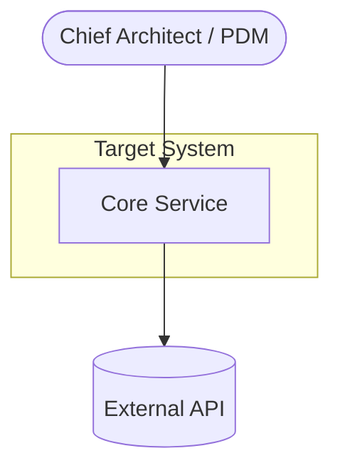
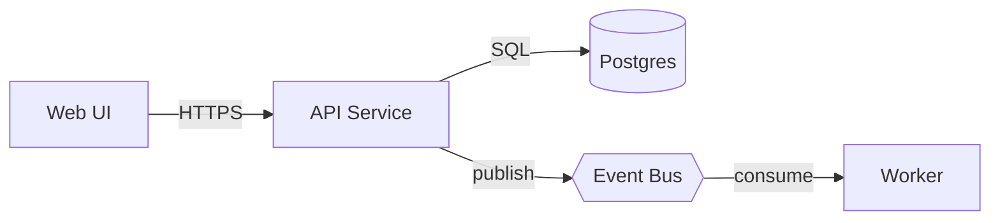
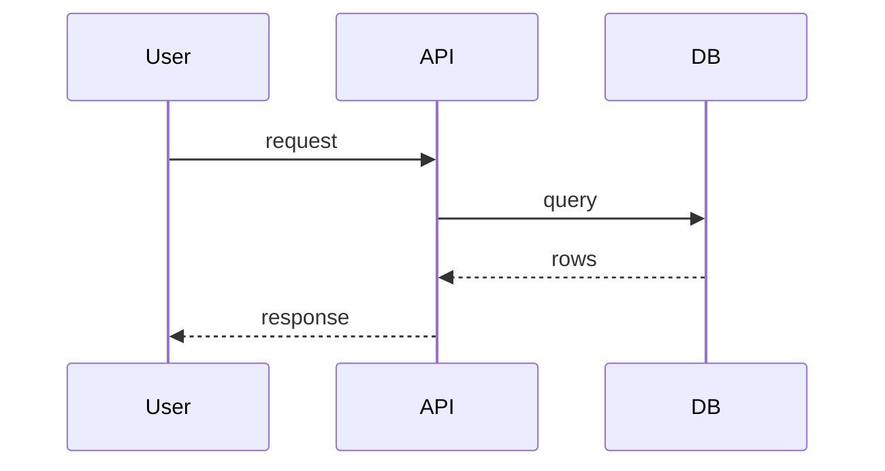
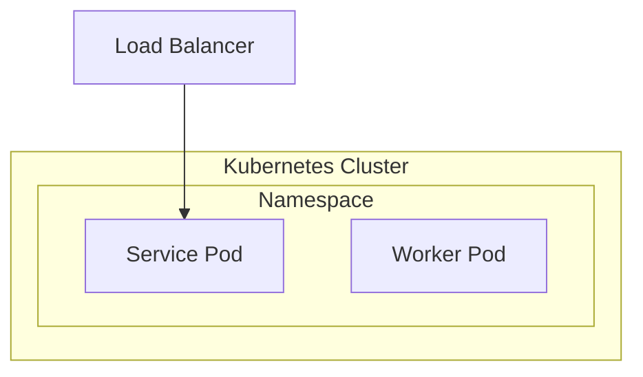

# Architecture diagramming

## Purpose

Give leadership a visual they can reason about. Diagrams are Mermaid code fences
so they render in Gitea/GitHub markdown and stay diffable in Git (no binary
image assets).

## When to use

- The `solution-architecture` skill requests context/container/sequence/
  deployment views.
- Any option, flow, or cost model that is clearer as a picture.

## Diagram catalogue

Pick the smallest set that tells the story. For an HLD, usually: 1 context, 1
container, 1–2 sequences, 1 deployment.

### C4 Context (system + actors + external systems)



### C4 Container (deployable units + protocols)



### Sequence (walk one scenario)



### Deployment (topology / substrate)



Use `stateDiagram-v2` for lifecycle/state machines and `flowchart` with
subgraphs for data-flow or capex/opex breakdowns when a picture helps.

## Standards

1. **Every diagram has a caption** naming what it shows and its C4 level.
2. **Label edges** with protocol and sync/async (`HTTPS`, `gRPC`, `publish`,
   `async`), not bare arrows.
3. **Direction:** `TB` for hierarchy/deployment, `LR` for pipelines/flows.
4. **Legibility:** ≤ ~12 nodes per diagram; split rather than crowd. Use
   `subgraph` for boundaries (cluster, namespace, VPC, trust zone).
5. **Consistency:** the same component name across all diagrams and the prose
   (must match `solution-architecture` container names).
6. **No secrets** in labels (no tokens, keys, or internal hostnames that leak
   security posture unnecessarily).
7. **Validate syntax** before embedding: keep fences as ` ```mermaid `, one
   diagram per fence, no trailing stray nodes. If a renderer is available via
   `bash`, do a quick parse; otherwise re-read the fence for balanced brackets
   and defined nodes.

## Output contract

Return each diagram as a fenced ` ```mermaid ` block immediately followed by a
one-line **caption** in italics. Group them so `architecture-document` can place
the context/container pair at the top of the Solution Overview.

## Quality checks

- [ ] Solution Overview has a diagram before any prose.
- [ ] Edges are labeled with protocol + sync/async.
- [ ] Node names match the prose and other diagrams exactly.
- [ ] Each diagram ≤ ~12 nodes; boundaries shown via subgraphs.
- [ ] Every diagram has a caption and a C4 level (where applicable).
- [ ] Mermaid parses (balanced brackets, all referenced nodes defined).
